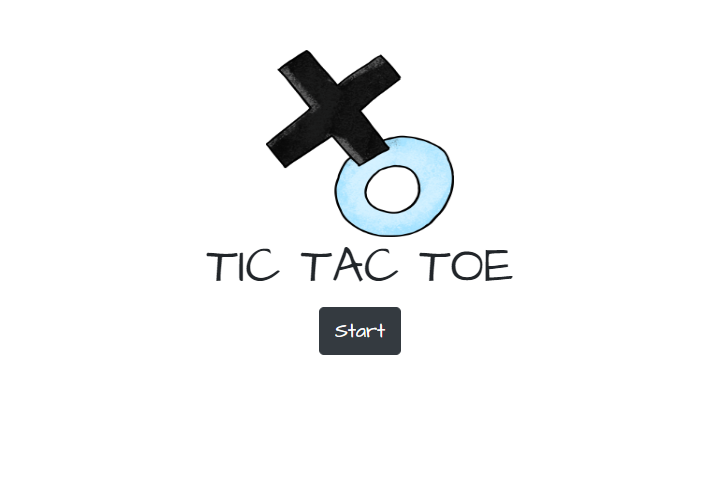
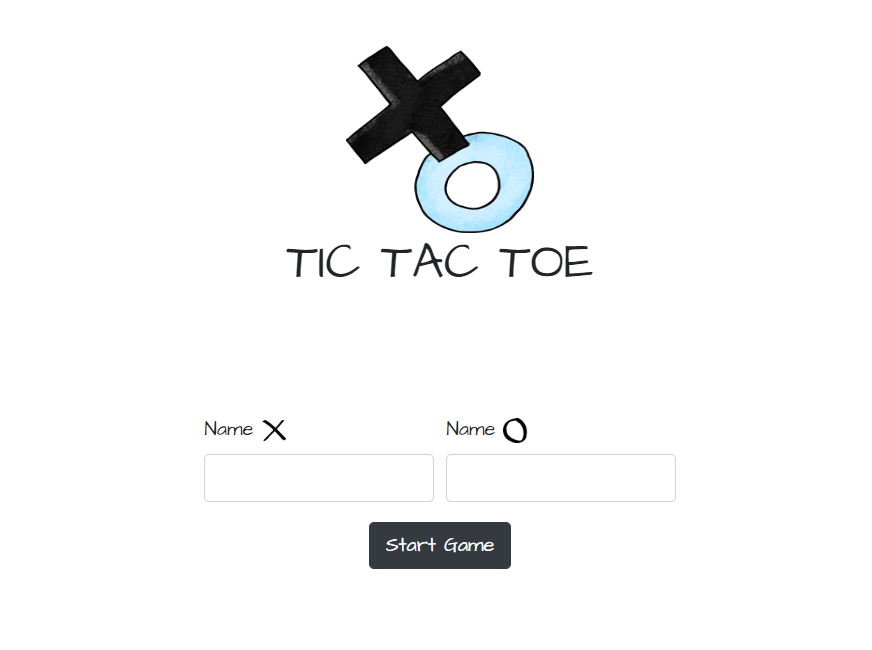
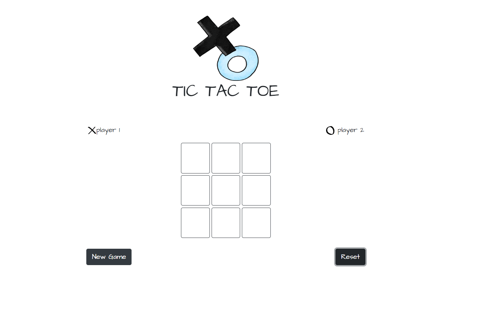
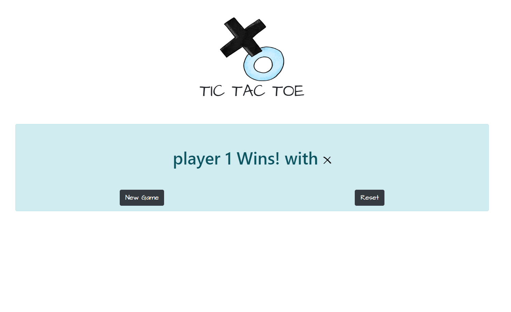

* Welcome page: with the Logo and the 'start' button which will disappears when the user clicks it.

* After clicking the 'start' button the program have to aks the players their names. The program has to validate the inputs in case they are empties

* After the inputs the program displays the board game with the players names and 2 button. 'Reset' and 'New Game':

'Reset button' cleans the board and remains the players names. 
'New Game button' starts a new game with new players

* finally in case there is a winner. The program must display the winner's name and the same two previous buttons.

